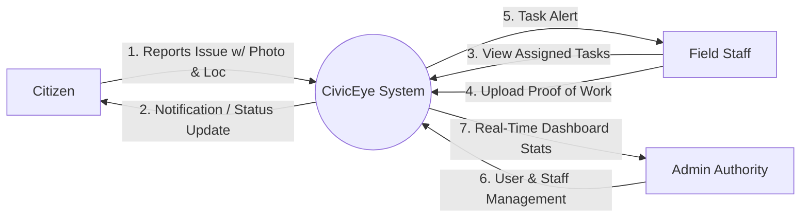
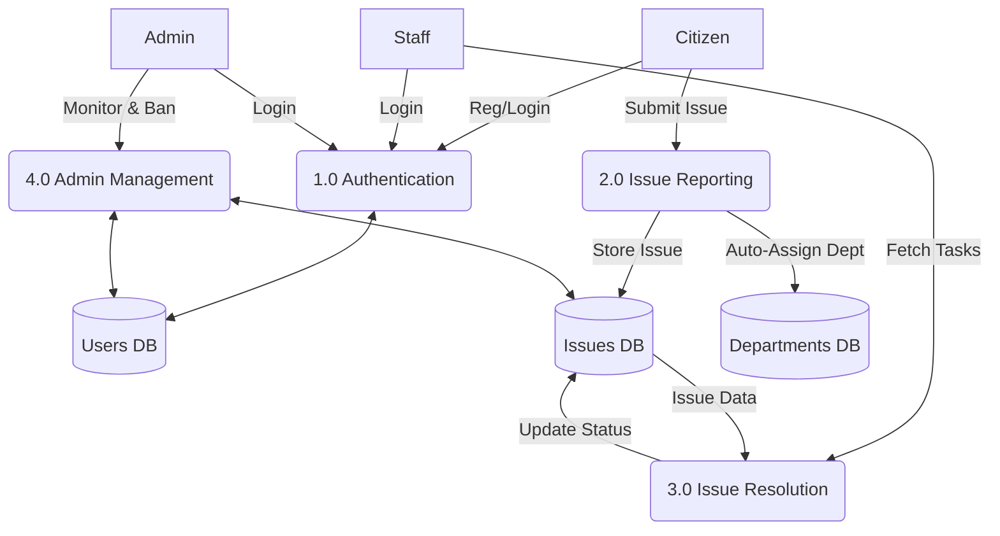
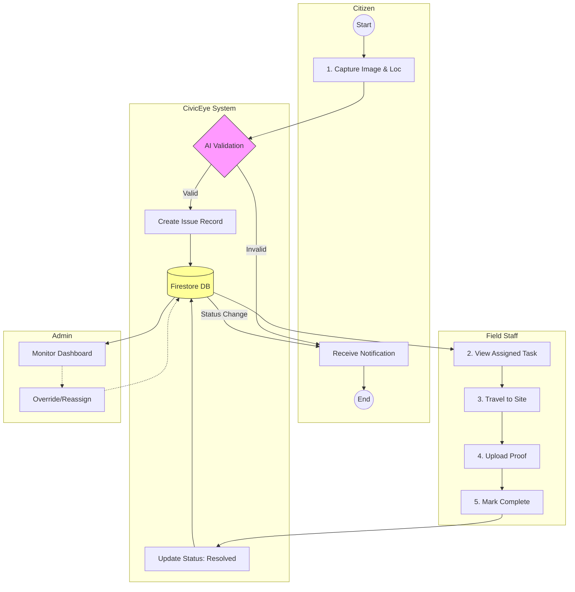
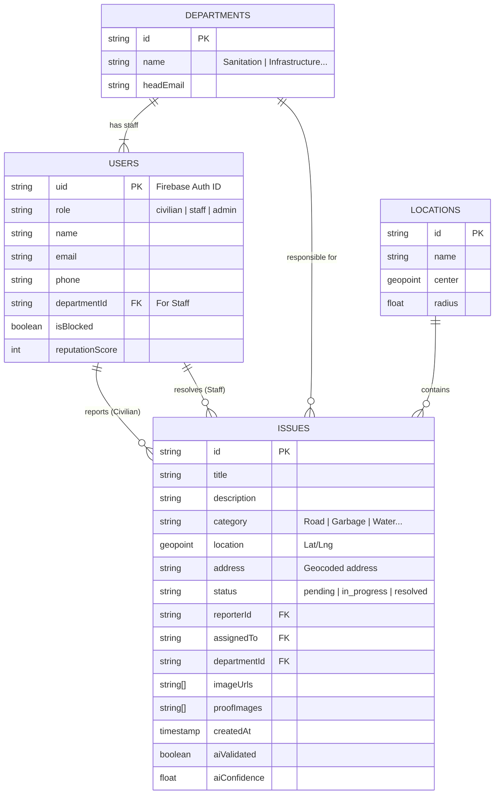

# CivicEye Project Documentation

## 1. System Overview
CivicEye is a comprehensive civic issue reporting platform designed to bridge the gap between citizens and municipal authorities.
- **Android App**: Used by citizens to report issues (potholes, garbage, etc.) and by staff to view and resolve assignments.
- **Web Admin Panel**: Used by administrators to manage users, view real-time statistics, and oversee issue resolution.
- **Backend**: Google Firebase (Firestore, Auth, Storage) handles real-time data synchronization.

## 2. Technology Stack

### Mobile Application (Android)
- **Language**: Kotlin
- **Architecture**: MVVM (Model-View-ViewModel)
- **UI Framework**: XML Layouts with Material Design components
- **Dependency Injection**: Hilt
- **Asynchronous Programming**: Coroutines & Flow
- **Image Loading**: Coil
- **Maps**: Google Maps SDK for Android
- **Networking/Data**: Firebase Android SDK

### Web Admin Panel
- **Core**: HTML5, CSS3, JavaScript (ES6+)
- **Styling**: Custom CSS (Responsive Grid/Flexbox)
- **Charts**: Chart.js (Data visualization)
- **Maps**: Google Maps JavaScript API
- **Data/Auth**: Firebase Web SDK (v9 compat)

### Backend & Infrastructure
- **Database**: Cloud Firestore (NoSQL, Real-time)
- **Authentication**: Firebase Auth (Email/Password, Custom Claims)
- **Storage**: Firebase Storage (Image assets)
- **AI Integration**: Google Gemini API (Content validation & analysis)
- **Hosting**: Firebase Hosting (implied for Web Admin)

---

## 3. Data Flow Diagrams (DFD)

### DFD Level 0 (Context Diagram)
This high-level view shows the interaction between external entities (Users) and the CivicEye System.

### DFD Level 1 (Process Breakdown)
Breakdown of the main functional modules: Authentication, Issue Management, and Administration.

##### 4. Working of the Project

The CivicEye system operates through three primary interfaces, each serving a distinct user role in the issue resolution lifecycle.

1.  **Issue Reporting (Citizen)**:
    *   A citizen logs into the Android app and clicks the "+" button.
    *   They capture a photo of the civic issue (e.g., a pothole) and the app automatically retrieves the GPS location.
    *   Google Gemini AI analyzes the image to verify it matches a valid category (e.g., ensuring it's a road issue, not a selfie) and assigns a relevance score.
    *   If valid, the issue is stored in Firestore, and the appropriate government department is notified.

2.  **Task Assignment & Resolution (Staff)**:
    *   Field staff receive real-time notifications for issues in their department.
    *   They view the location on a map and navigate to the site.
    *   After fixing the issue, they upload a "Proof of Work" photo.
    *   They mark the task as "Resolved," which updates the status across the entire system.

3.  **Management & Oversight (Admin)**:
    *   Administrators view a live dashboard showing pending, in-progress, and resolved issues.
    *   They can re-assign tasks, manage staff availability, or block users who submit spam.
    *   Changes made by admins reflect instantly on staff and citizen apps.

---

### DFD Level 2 (Detailed Issue Flow)
Detailed expansion of the Issue Reporting and Resolution processes, showing interactions between Civilian, Staff, and Admin.

---

## 3. Entity Relationship Diagram (ERD)
The database schema designed in Firestore.

