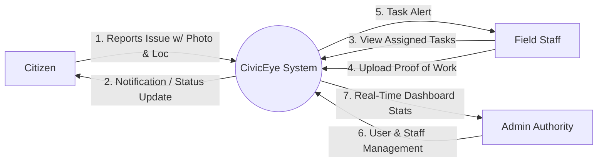
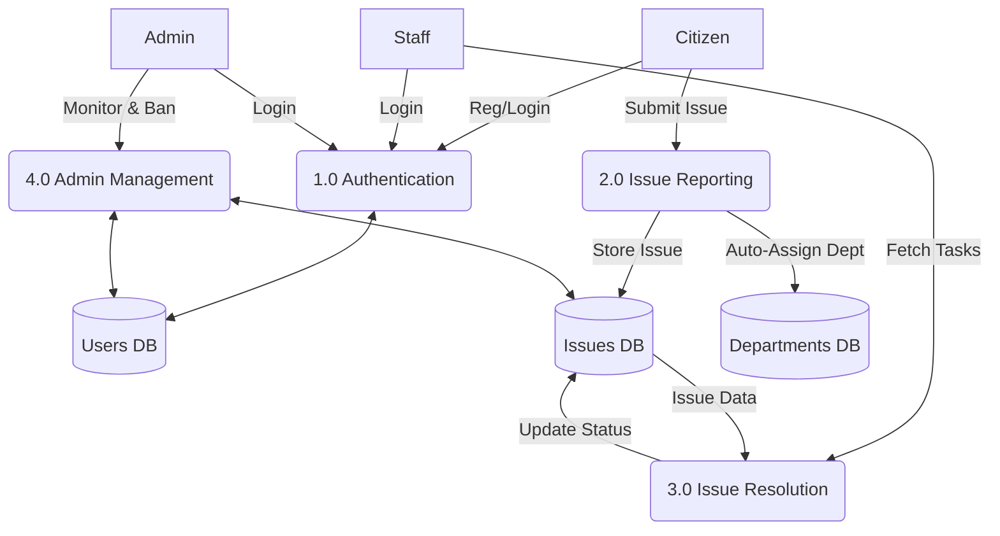
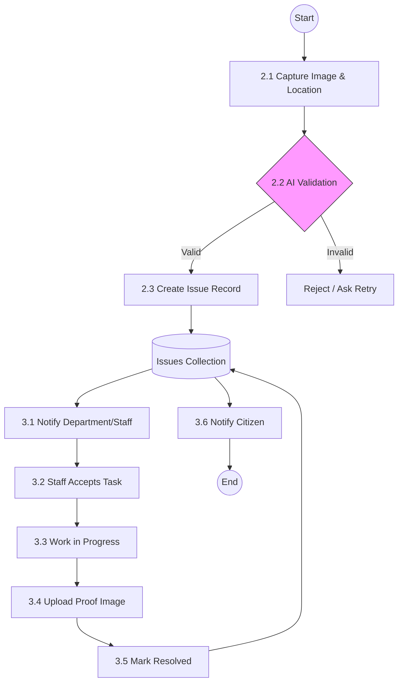
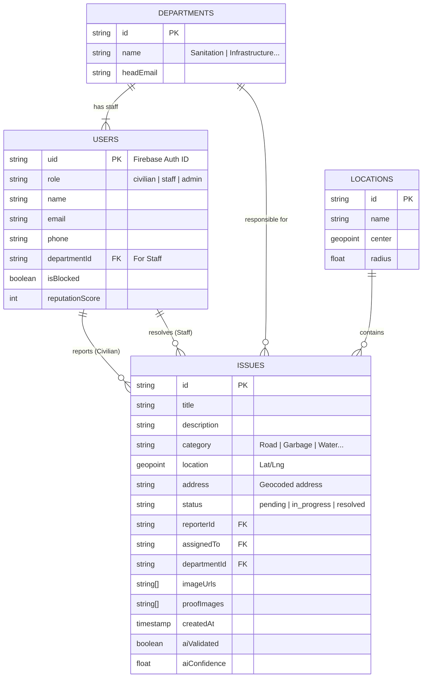

# CivicEye Project Documentation

## 1. System Overview
CivicEye is a comprehensive civic issue reporting platform designed to bridge the gap between citizens and municipal authorities.
- **Android App**: Used by citizens to report issues (potholes, garbage, etc.) and by staff to view and resolve assignments.
- **Web Admin Panel**: Used by administrators to manage users, view real-time statistics, and oversee issue resolution.
- **Backend**: Google Firebase (Firestore, Auth, Storage) handles real-time data synchronization.

## 2. Technology Stack

### Mobile Application (Android)
- **Language**: Kotlin
- **Architecture**: MVVM (Model-View-ViewModel)
- **UI Framework**: XML Layouts with Material Design components
- **Dependency Injection**: Hilt
- **Asynchronous Programming**: Coroutines & Flow
- **Image Loading**: Coil
- **Maps**: Google Maps SDK for Android
- **Networking/Data**: Firebase Android SDK

### Web Admin Panel
- **Core**: HTML5, CSS3, JavaScript (ES6+)
- **Styling**: Custom CSS (Responsive Grid/Flexbox)
- **Charts**: Chart.js (Data visualization)
- **Maps**: Google Maps JavaScript API
- **Data/Auth**: Firebase Web SDK (v9 compat)

### Backend & Infrastructure
- **Database**: Cloud Firestore (NoSQL, Real-time)
- **Authentication**: Firebase Auth (Email/Password, Custom Claims)
- **Storage**: Firebase Storage (Image assets)
- **AI Integration**: Google Gemini API (Content validation & analysis)
- **Hosting**: Firebase Hosting (implied for Web Admin)

---

## 3. Data Flow Diagrams (DFD)

### DFD Level 0 (Context Diagram)
This high-level view shows the interaction between external entities (Users) and the CivicEye System.

### DFD Level 1 (Process Breakdown)
Breakdown of the main functional modules: Authentication, Issue Management, and Administration.

### DFD Level 2 (Detailed Issue Flow)
Detailed expansion of the **2.0 Issue Reporting** and **3.0 Resolution** processes.

---

## 3. Entity Relationship Diagram (ERD)
The database schema designed in Firestore.

